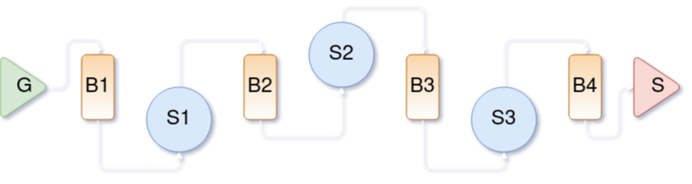

# yap

[](https://github.com/picanumber/yap_prelude/actions/workflows/ubuntu.yml) [](https://github.com/picanumber/yap_prelude/actions/workflows/codecov.yml) [](https://github.com/picanumber/yap_prelude/actions/workflows/style.yml) [](https://github.com/picanumber/yap_prelude/actions/workflows/asan.yml) [](https://github.com/picanumber/yap_prelude/actions/workflows/tsan.yml)



## Contents
- [Design](#Design)
- [Motivation](#Motivation)
- [Construction](#Construction)
  - [Strongly typed](#Strongly-typed)
  - [Polymorphic](#Polymorphic)
- [Operations](#Operations)
  - [Run](#Run)
  - [Stop](#Stop)
  - [Pause](#Pause)
  - [Consume](#Consume)
- [Examples](#Examples)
- [Installation](#Installation)

## Design

yap stands for __yet another pipeline__. It is a zero dependency, header only library providing a multi-threaded implementation of the pipeline pattern. This enables a user to define a series of transformations where:

1. Each stage runs in its own thread.
2. Buffering exists between stages to regulate stages of different latency.
3. The first stage is considered a __generator__, meaning it's the entity that feeds data into the pipeline.
4. Intermediate stages can have any `input`/`output` type, provided that the resulting chain is feasible, e.g. output of stage 2 can be an input to stage 3. Correctness in this respect is checked during compilation time.
5. The final stage is considered a __sink__, meaning it's the entity that extracts data from the pipeline.

Using a pipeline can be as simple as:

```cpp
auto pln = yap::Pipeline{} | dataReader | stage1 | stage2 | storeOutput;
pln.run();  // Non-blocking call.
```

## Motivation

yap is provided as an alternative to pipelines in large general purpose libraries for multi-threading. If you want to:

* Incorporate with code using standard thread facilities.
* Avoid the learning curve.
* Easily get acquainted with the parallel pipeline pattern.
* Just use the "pipeline" part.

you can try-out yap as a library having:

* Zero dependencies.
* Vanilla c++20.
* Exclusive use of C++ standard facilities like `<thread>` and friends.

## Construction

This section outlines how to create a pipeline. To help drive our points, assume the existence of the following callables:

```cpp
auto generator = [val = 0] () mutable { return val++; };
auto transform = [](int val) { return std::to_string(val); };
auto sink = [](std::string const& s) { std::cout << s << std::endl; };
```

Stages that participate in a pipeline must have conforming input/output types, i.e. the output of one stage must be usable as an input to the next. The example above shows the following transformation from generator to sink:

```
[void, int] -> [int, string] -> [string, void]
```

infeasible type transformations result in compilation errors.

### Strongly typed

To construct a pipeline with a type mandated by the input/output types of each stage, simply pipe the required stages into `yap::Pipeline{}`:

```cpp
auto ps = yap::Pipeline{} | generator | transform | sink;
```

The `pipeLine` object above will be typed as `yap::Pipeline<void,int, int,string, string,void>`. A user does not have to specify the type that results from the specified transformations, since [CTAD](https://en.cppreference.com/w/cpp/language/class_template_argument_deduction) handles this process. A strongly typed pipeline can be moved into a "greater" pipeline to be chained with additional stages at a later point, provided that a sink stage has not been attached.

### Polymorphic

There are cases where having a strong type is cumbersome or plainly does not offer much benefit, e.g. when no special treatment is planned for pipeline objects of different types or when a pipeline member object needs to create as less noise to the containing class. In such cases a user can use a pipeline through its polymorphic base class:

```cpp
auto pp = yap::make_pipeline(generator, transform, sink);
```

The object returned from the `make_pipeline` function, is a `unique_ptr<yap::pipeline>`. This lower-case `pipeline` base class, is the abstract definition of a pipeline and even though information on type transformations is lost, all operations are carried out in way consistent to its construction properties. A polymorphic pipeline cannot be chained further, since information on how to relay types is lost.

## Operations

This section describes the operations available to a pipeline. Bear in mind that depending on the construction method, you'd be calling an operation on a value or a pointer:

```cpp
ps.operation();  // Strongly typed pipeline.
pp->operation(); // Polymorphic pipeline.
```

### Run

The `run` method fires up the task processing threads on each stage and starts the moving of the data from one place to another. Note that since there's buffering between stages, unstable latency of stages is accounted for and data is pushed as forward as possible so that is available for processing as soon as possible.

```cpp
ps.run(); // A running pipeline stops on its destructor.
```

No preconditions are imposed to the `run` method apart from having a properly constructed object.

### Stop

The `stop` method only has effect on a running or paused pipeline. It ceases all processing threads, meaning after its call no invocation of the user provided callables is possible. Additionally it clears the intermediate buffers, meaning non-processed data left in the pipeline will be discarded.

```cpp
auto res = pp.stop();

if (yap::ReturnValue::NoOp == res)
{
  std::cout << "The pipeline was not running" << std::endl;
}

pp.stop(); // No effect, we just stopped above.
```

### Pause

The `pause` method only has effect on a running pipeline. It ceases all processing threads, meaning after its call no invocation of the user provided callables is possible. Unlike `stop`, it does NOT clear the intermediate buffers, meaning subsequent calls to `run` will pick-up processing where it was left.

```cpp
auto res = pp.pause();
// ...
// Other task, e.g. non threadsafe modification of a stage.
// ...
pp.run(); // Non-processed data will resume processing.
```

### Consume

A use case might be that of processing a fixed amount of data. When this need arises, the generator stage can inform the pipeline on the end of the data stream by throwing a `GeneratorExit` exception. To run the pipeline until all data is processed, the `consume` method exists:

```cpp
auto gen = [val = 0] () mutable {
  if (val > 1'000'000) throw yap::GeneratorExit{};
  return val++;
};

auto pp = yap::make_pipeline(gen, stage1, stage2, stage3, sink);

// Run the pipeline until all data is processed.
pp->consume();
```

Consuming a pipeline leaves it in an idle state, with no threads running. `run` can be called once again, assuming the generator can produce more data, but `stop` or `pause` have no effect. A pipeline whose generator throws `yap::GeneratorExit` will anyways cease when all input is processed. The `consume` method is a way to explicitly wait for data to be processed and make the pipeline "runable" again.

## Examples

Examples can be found in the respective folder.

## Installation

This is a header only library. You can download and build the test suite which is using Google Test, but all you need to do to use the library is to point your build system to the `include` folder.
