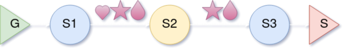
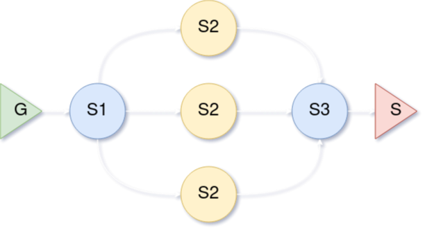
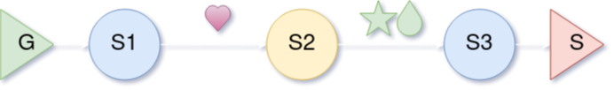

# yapp
##### A parallel pipeline for stream processing

[](http://www.repostatus.org/#active)
[](https://github.com/XAMPPRocky/tokei)
[](https://github.com/picanumber/task_timetable/blob/a7b8eb6eed728255221909583d9e757b4e345a5a/LICENSE)

[](https://github.com/picanumber/yap_prelude/actions/workflows/ubuntu.yml)
[](https://github.com/picanumber/yapp/actions/workflows/tsan.yml)
[](https://github.com/picanumber/yapp/actions/workflows/asan.yml)
[](https://github.com/picanumber/yapp/actions/workflows/codacy.yml)
[](https://github.com/picanumber/yap_prelude/actions/workflows/style.yml)


## Contents
- [Design](#Design)
- [Motivation](#Motivation)
- [Construction](#Construction)
  - [Strongly typed](#Strongly-typed)
  - [Polymorphic](#Polymorphic)
  - [Side notes](#Side-notes)
- [Operations](#Operations)
  - [Run](#Run)
  - [Stop](#Stop)
  - [Pause](#Pause)
  - [Consume](#Consume)
- [Topology](#Topology)
  - [Filter](#Filter)
  - [Farm](#Farm)
  - [Hatch](#Hatch)
- [Utilities](#Utilities)
  - [Consumer](#Consumer)
- [Examples](#Examples)
  - [Basic examples](#Basic-examples)
  - [Top k words](#Top-k-words)
  - [2D data operations](#2D-data-operations)
- [Installation](#Installation)

## Design

yapp is __yet another parallel pipeline__. It is a zero dependency, header only library providing a __multi-threaded implementation of the pipeline pattern__. It enables users to define a series of stages where:

1. Each stage runs in its own thread.
2. Buffering exists between stages to regulate stages of different latency.
3. The first stage is considered a __generator__, meaning it's the entity that feeds data into the pipeline.
4. Intermediate stages can have any `input`/`output` type, provided that the resulting chain is feasible, e.g. output of stage 2 can be an input to stage 3. Correctness in this respect is checked during compilation.
5. The final stage is considered a __sink__, meaning it's the entity that extracts data from the pipeline.

Using a pipeline can be as simple as:

```cpp
auto pln = yap::Pipeline{} | dataReader | stage1 | stage2 | storeOutput;
pln.run();  // Non-blocking call.
```

## Motivation

yapp is provided as an alternative to pipelines in large general purpose libraries for multi-threading. If you want to:

* Smoothly collaborate with code using standard thread facilities.
* Avoid the (bigger) learning curve.
* Easily get acquainted with the parallel pipeline pattern.
* Just use the "pipeline" part.

you can try-out yapp, which sports:

* Zero dependencies.
* Vanilla c++20.
* Exclusive use of C++ standard facilities like `<thread>` and friends.
* __Metaprogrammed stitching of user provided callables into pipeline stages__.

For a short introduction to the parallel pipeline pattern you can [check this post](https://ngathanasiou.wordpress.com/2022/06/30/pipelines-to-the-rescue/).

## Construction

This section outlines how to create a pipeline. To help drive our points, assume the existence of:

```cpp
auto generator = [val = 0] () mutable { return val++; };
auto transform = [](int val) { return std::to_string(val); };
auto sink = [](std::string const& s) { std::cout << s << std::endl; };
```

The example above shows the following data-flow from generator to sink:

```
[void, int] -> [int, string] -> [string, void]
```

infeasible type transformations result in compilation errors.

### Strongly typed

To construct a pipeline with a type mandated by the input/output types of each stage, simply pipe the required stages into `yap::Pipeline{}`:

```cpp
auto ps = yap::Pipeline{} | generator | transform | sink;
```

The `pipeLine` object above will be of type `yap::Pipeline<void,int, int,string, string,void>`. A user does not have to specify the type that results from the specified transformations, since [CTAD](https://en.cppreference.com/w/cpp/language/class_template_argument_deduction) handles this process. A strongly typed pipeline can be moved into a another pipeline to be chained with additional stages at a later point, provided that a sink stage has not yet been attached.

### Polymorphic

There are cases where having a strong type is cumbersome or plainly of little benefit, e.g. when no special treatment is planned for pipeline objects of different types or when a pipeline member object needs to create little noise to the containing class. In such cases a user can use a pipeline through its polymorphic base class:

```cpp
auto pp = yap::make_pipeline(generator, transform, sink);
```

The object returned from the `make_pipeline` function, is a `unique_ptr<yap::pipeline>`. This lower-case `pipeline` base class, is the abstract definition of a pipeline and even though information on type transformations is lost, all operations are carried out in way consistent to its construction properties. A polymorphic pipeline cannot be chained further, since information on how to relay types is lost.

### Side notes

* __Data flowing through pipeline stages can be move-only__, as shown in a [related example](https://github.com/picanumber/yap/blob/main/examples/basic/use_non_copyable_type.cpp).
* Similarly to how `std::thread` treats its callable argument, __callables provided as operations are move constructed__ in their respective stage. If an l-value is provided instead of a temporary object, the callable must be copy-constructible.

## Operations

This section describes the operations available to a pipeline. Bear in mind that depending on the construction method, you'd be calling an operation on a value or a pointer:

```cpp
ps.operation();   // Strongly typed pipeline.
pp->operation();  // Polymorphic pipeline.
```

### Run

The `run` method fires up the task processing threads on each stage. Note that since there's buffering between stages, unstable latency of stages is accounted for and data is pushed as forward as possible to be available for processing as soon as possible.

```cpp
ps.run();  // Non blocking-call. Fires up worker threads and continues.
           // A running pipeline will stop on its destructor.
```

No preconditions are imposed to the `run` method apart from having a properly constructed object.

### Stop

The `stop` method only has effect on a running or paused pipeline. It ceases all processing threads, meaning after its call no invocation of the user provided operations is possible. Additionally, it clears the intermediate buffers, meaning non-processed data left in the pipeline will be discarded.

```cpp
auto res = pp.stop();

if (yap::ReturnValue::NoOp == res)
{
    std::cout << "The pipeline was not running" << std::endl;
}

pp.stop();  // No effect, we just stopped above.
```

### Pause

The `pause` method only has effect on running pipelines. It ceases all processing threads but unlike `stop`, it does NOT clear the intermediate buffers, meaning a subsequent call to `run` will resume processing.

```cpp
auto res = pp.pause();
// ...
// Other task, e.g. non threadsafe modification of a stage.
// ...
pp.run(); // Non-processed data will resume processing.
```

### Consume

A use case might be that of processing a fixed amount of data. When this need arises, the generator stage can inform the pipeline on the end of the data stream by throwing a `GeneratorExit` exception. To run the pipeline until all data up to that point is processed, the `consume` method exists:

```cpp
auto gen = [val = 0] () mutable {
  if (val > 1'000'000) throw yap::GeneratorExit{};
  return val++;
};

auto pp = yap::make_pipeline(gen, stage1, stage2, stage3, sink);

// Run the pipeline until all data is processed. Blocking call.
pp->consume();
```

Consuming a pipeline leaves it in an idle state, with no threads running. `run` can be called once again, assuming the generator can produce more data, but `stop` or `pause` have no effect. A pipeline whose generator throws `yap::GeneratorExit` will anyways cease when all input is processed. The `consume` method is a way to explicitly wait for data to be processed and make the pipeline "runable" again.

## Topology

This section describes the tools to modify a pipeline's topology. Such a modification alters the linear flow of information from one stage to its subsequent, to provide properties that are attractive to specific computational patterns.

### [Filter](https://github.com/picanumber/yapp/blob/main/examples/basic/use_filtered.cpp)

A _filtering stage_ is one that can discard part of its input. As depicted below, `S2` can control the input items to pass to subsequent stages, while being free to perform any type of transformation:



__A callable returning `yap::Filtered` is considered a filtering stage__. The filtered object is just a wrapper around `std::optional<T>`:

```cpp
template <class T>
struct Filtered
{
    std::optional<T> data;

    Filtered() = default;
    explicit Filtered(T &&data) : data(std::move(data)) {}
    explicit Filtered(std::optional<T> &&data) : data(std::move(data)) {}
};
```

The `std::optional` type was not used directly, since explicit use cases exist for `nullopt`, for example a stage handling "empty" or "filler" inputs. To avoid propagating data further down the pipeline, simply place an empty optional in the `Filtered<T>` return value of your stage. Conversely, filling the `data` member with a value means passing the data to the next stage.  

To __provide explicit syntax to your pipeline declaration__, a helper `Filter` caller can be used. This is a "call forwarding" wrapper that can use either  `std::optional` or `yap::Filtered` return types:

```cpp
auto oddPrinter = yap::Pipeline{}
    | gen
    | yap::Filter(s2)  // Explicitly declared filtering stage.
    | intPrinter{};
```

__A stage following a filter__ should accept a `yap::Filtered<T>` input. It can safely assume that the `data` member of the input is not `nullopt`.

### Farm



### [Hatch](https://github.com/picanumber/yapp/blob/main/examples/basic/use_hatched.cpp)

A _hatching stage_ is one that can produce more than one outputs for a single input. In the diagram below, `S2` is such a stage:  



Note that this process is __fundamentally different from producing a collection of objects__. __A typical example where you might want to hatch your input is when processing text files__, say line by line. If the stage that produced the lines was to scan the whole text file and output a vector of text lines (strings) then you'd face the following deficiencies:

1. Extraneous memory used to hold the entirety of the text file. The program only needs a single line "in-flight" to do its processing.
2. The next stage has to wait until the whole file has been read. A "vector of lines" implies that text processing can only begin __after__ reading all of the text file.

Such a situation can be greatly improved if the "text reader" stage produces its output in a piece wise fashion: Each line that is ready, gets immediately pushed to the next stage for processing.

__To create a hatching stage__ use a callable that accepts `yap::Hatchable` objects as input, a class with logic similar to `yap::Filtered` that conveys how the stage does its processing:

1. The `yap::Hatchable` is convertible to `bool`. `true` means new input while `false` (empty optional) means you're still processing the last input.
2. The hatching stage outputs an object that is convertible to `bool`, e.g. an `std::optional` or again `yap::Hatchable`. __The pipeline stops processing the same input when the output is `false`__, alternatively it keeps invoking the stage with an empty `yap::Hatchable` to produce more output from the last input.

```cpp
auto exampleHatchingStage = [](yap::Hatchable<int> input)
{
     std::optional<char> ret;

     if (val)
     {  
         // New Input from previous stage. Input data is non empty.
         std::optional<int> &curInput = input.data;
         assert(curInput);
     }
     else
     {  
         // Keep processing the last input from previous stage. Input data is empty.
         assert(!input.data);
     }

     return ret; // Returning a contextually "false" object, here empty
                 // optional, means the input won't be hatched any more and
                 // the stage can process new values produced from the
                 // previous stage.
};
```

To __provide explicit syntax to your pipeline declaration__, a helper `OutputHatchable` caller can be used to denote the stage producing input for the hatching stage. This is a "call forwarding" wrapper that wraps the output of a stage into `yap::Hatchable` return types:

```cpp
auto hp = yap::Pipeline{}
    | yap::OutputHatchable(generator) // The previous stage can be annotated.
    | exampleHatchingStage
    | sinkStage{};
```

## Utilities

Utilities that accompany the library are described here. Creating a huge suite of accompanying tools is a non-goal for this library, however there should be provision for patterns that are often encountered. In that spirit, the following tools are made.

### Consumer

A consumer is a generator that can use a standard iterable container. It handles:

* Going through the elements of a container.
* Quitting the pipeline on "end of input".

Usage on a container `c` is pretty straightforward:

```cpp
// Input values are copied into the pipeline. Container is left untouched.
auto p1 = yap::Pipeline{} | yap::Consume(c.begin(), c.end()) | ...

// Input values are moved into the pipeline. Container has "moved-from" objects.
auto p2 = yap::Pipeline{} |
  yap::Consume(std::make_move_iterator(c.begin()), std::make_move_iterator(c.end())) | ...
```

## Examples

Examples can be found in the respective [folder](https://github.com/picanumber/yap/tree/main/examples). Each example folder is accompanied by a `README.md` file that documents it. In summary, the contents are:

### [Basic examples](https://github.com/picanumber/yap/tree/main/examples/basic)

These examples showcase simple usages of the library, and how it successfully manages:

* Non copyable data.
* Stages that return futures, e.g. because of an internal thread-pool.
* Filtering stages.

### [Top k words](https://github.com/picanumber/yap/tree/main/examples/top_k_words)

We analyze an input file and output the `k` most frequent words in the text.

### [2D data operations](https://github.com/picanumber/yap/tree/main/examples/2d_data_operations)

Usage of the framework with stages of substantial computational effort, while passing 2d data from one stage to another. Serves as a profiling experiment to deduce next steps and drive optimization efforts.

## Installation

This is a header only library. You can download and build the test suite which is using Google Test, but all you need to do to use the library is to point your build system to the `include` folder.
